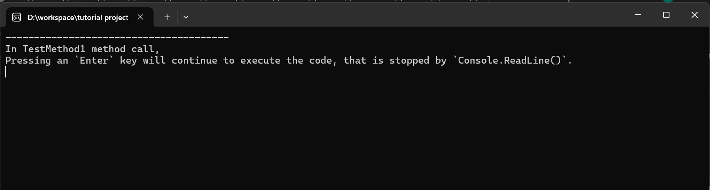

# CH1 -- intro
## objectives
You will know

+ what is Console

+ console in C#

## CH1.1 -- what is Console
A console in computer science is something that prints text to.

Here is a figure illustrate a console. 

DOS, Command Line Prompt are kinds of console.

## console in C#
In `C#`, when a project is built and then executed, 

it will pop up a console which is `System.Console` object (`Console` class in `System` namespace).

Thus, one can configure settings of the console and behavior of console with `System.Console` object.

For example,

In `C#`, one can prints text to console by invoking 

+ `Console.WriteLine` static method

+ `Console.Write` static method

which will be discussed in CH2.

## CH1.3 -- `Console`
### `Console` static object
#### namespace
`System`

## reference
### terms
+ [`Consoles`](https://learn.microsoft.com/en-us/windows/console/consoles)

### API docs
+ [`Console Class`](https://learn.microsoft.com/en-us/dotnet/api/system.console?view=net-9.0)